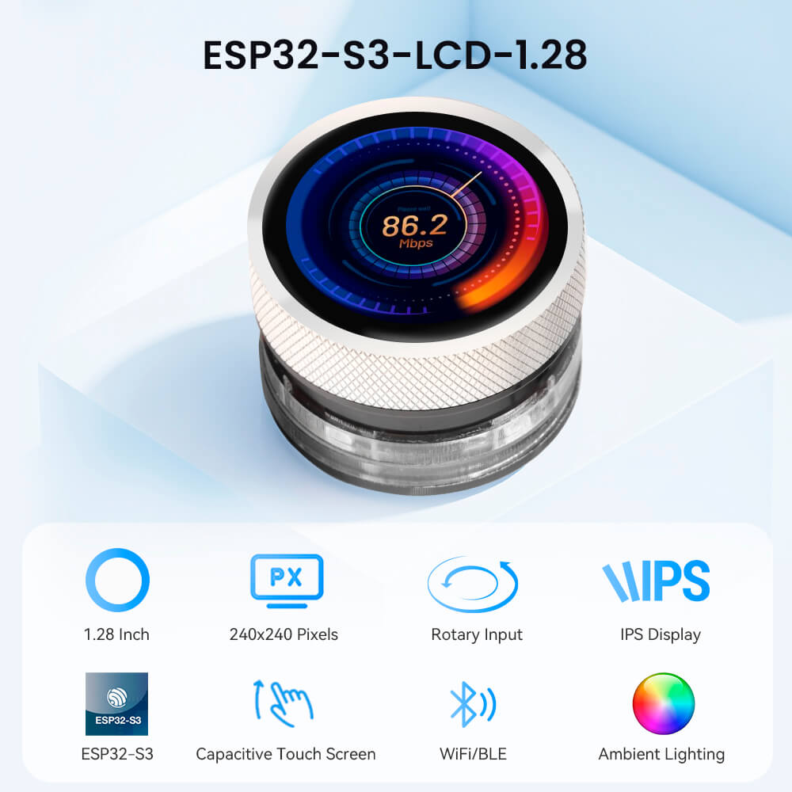
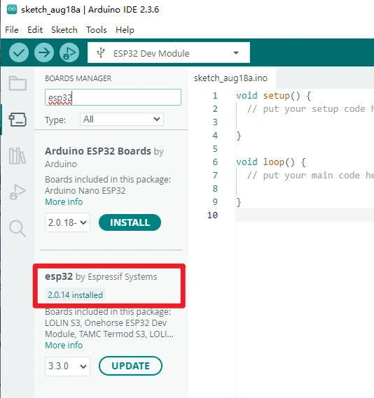
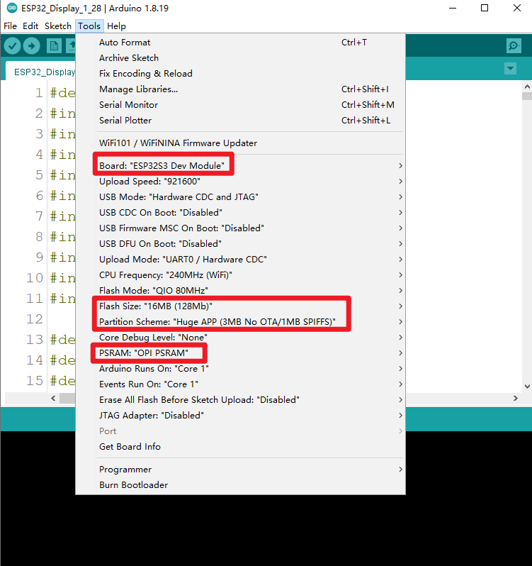

### 1, Product picture

### 2, Product version number

|      | Hardware | Software | Remark |
| ---- | -------- | -------- | ------ |
| 1    | V1.0     | V1.0     | latest |

### 3, product information

#### Display Module Specifications

| Main Chip: ESP32-S3R8  |                                                              |
| ---------------------- | ------------------------------------------------------------ |
| Processor              | Equipped with high-performance Xtensa 32-bit LX7 dual-core processor, with a main frequency of up to 240MHz |
| System memory          | 512KB SRAM、8M PSRAM                                         |
| Storage                | 16M Flash                                                    |
| Screen                 |                                                              |
| Size                   | 1.28 inch                                                    |
| Screen Type            | IPS                                                          |
| Touch Type             | Capacitive Touch                                             |
| Resolution             | 240*240                                                      |
| Wireless Communication |                                                              |
| Bluetooth              | Bluetooth Low Energy and Bluetooth 5.0                       |
| WiFi                   | Support 802.11a/b/g/n，2.4GH                                 |
| Hardware               |                                                              |
| UART Interface         | 2x UART, 4P 1.25mm                                           |
| I2C interface          | 4P 1.25mm                                                    |
| FPC connector          | 12P, Power supply burning port                               |
| Button                 | RESET button, BOOT button, confirmation button (knob press switch) |
| LED Light              | Power indicator, LED ambient light                           |
| Other                  |                                                              |
| Power Input            | 5V/1A                                                        |
| Operating temperature  | -20~65℃                                                      |
| Storage temperature    | -40~80℃                                                      |
| Operation Power        | Module：DC5V  Main Chip：3.3V                                |
| Size                   | 48*48*33mm                                                   |
| Shell                  | Aluminum alloy + plastic + acrylic                           |
| Net Weight             | 50g                                                          |

### 4, Use the driver module

### 5,Quick Start

##### Arduino IDE starts

1.Download the library files used by this product to the 'libraries' folder.

C:\Users\Documents\Arduino\libraries\

2.Open the Arduino IDE

3.Open the code configuration environment and burn it.

### 6,Folder structure.

|--3D file： Contains 3D model files (.stp) for the hardware. These files can be used for visualization, enclosure design, or integration into CAD software.

|--Datasheet: Includes datasheets for components used in the project, providing detailed specifications, electrical characteristics, and pin configurations.

|--Eagle_SCH&PCB: Contains **Eagle CAD** schematic (`.sch`) and PCB layout (`.brd`) files. These are used for circuit design and PCB manufacturing.

|--example: Provides example code and projects to demonstrate how to use the hardware and libraries. These examples help users get started quickly.

|--factory_firmware: Stores pre-compiled factory firmware that can be directly flashed onto the device. This ensures the device runs the default functionality.

|--factory_sourcecode: Contains the source code for the factory firmware, allowing users to modify and rebuild the firmware as needed.

### 7,Pin definition

#define TP_I2C_SDA_PIN 6

#define TP_I2C_SCL_PIN 7

#define I2C_SDA_PIN 38

#define I2C_SCL_PIN 39

#define ENCODER_A_PIN 45

#define ENCODER_B_PIN 42

#define SWITCH_PIN 41

#define OLED_RESET -1

#define SCREEN_WIDTH 128     // OLED display width, in pixels

#define SCREEN_HEIGHT 64     // OLED display height, in pixels

#define SCREEN_ADDRESS 0x3C  ///< See datasheet for Address; 0x3D for 128x64, 0x3C for 128x32